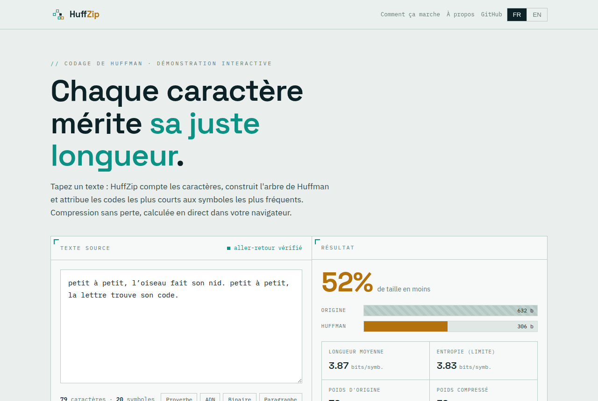

# HuffZip

**Lossless text compression with Huffman coding — computed live in the browser.**

HuffZip turns a piece of text into its Huffman encoding and shows every step of
the way: the frequency of each character, the binary tree that assigns short
codes to frequent symbols, the code table, and the resulting bitstream. Nothing
is uploaded — the whole computation runs on your machine, and each compression
is re-decoded to prove it is lossless.



The project started as a 2022 university assignment: a compressor and a
decompressor written in C, with hand-rolled linked lists and binary trees and no
external libraries. That original engine still lives in [`engine/`](engine/).
The web application reuses the same algorithm, rewritten in dependency-free
JavaScript.

---

## Features

- **Live compression** — type or paste text and watch the ratio, entropy and
  average code length update instantly.
- **Import a `.txt` file** — drag and drop a text file (or pick one) to compress
  a whole book at once; it is read and processed in the browser and never leaves
  your machine.
- **Huffman tree view** — an SVG rebuilds as you type; left edges are `0`
  (teal), right edges are `1` (amber).
- **Code table** — every symbol with its frequency and its prefix-free code.
- **Bitstream** — the encoded output, grouped into bytes the way it is written
  to disk.
- **Round-trip check** — the encoder's output is decoded again on every change
  to guarantee the result is lossless.
- **Bilingual** — French and English, with the choice remembered between visits.
- **Zero dependencies, no external requests** — plain HTML, CSS and ES modules,
  with self-hosted fonts. No build step, no framework, no CDN, no tracking.

## Repository layout

```
.
├── index.html            Web application
├── mentions.html         Legal notice (French)
├── assets/
│   ├── css/style.css     Visual system
│   ├── js/huffman.js     Huffman core (frequencies, tree, codes, encode/decode)
│   ├── js/app.js         Interface, tree drawing, i18n
│   └── favicon.svg
├── engine/               Original C compressor / decompressor (2022)
│   ├── compression/
│   ├── decompression/
│   └── README.md
└── docs/preview.png
```

## Run locally

The site is fully static. Because it uses ES modules, open it through a local
web server rather than the `file://` protocol:

```bash
# any static server works, for example:
python3 -m http.server 8000
# then open http://localhost:8000
```

## Deploy on OVH shared hosting

The application is a set of static files, so no PHP, database or Node runtime is
required on the server.

1. Connect to your hosting with an FTP client (FileZilla) or over SSH, using the
   credentials from your OVH control panel.
2. Copy `index.html`, the `assets/` folder and the `docs/` folder into the web
   root of your hosting — usually the `www/` directory.
3. Open your domain in a browser. That is all — there is nothing to build.

To serve it under a subfolder (for example `example.com/huffzip`), create that
folder inside `www/` and upload the files there. All paths in the project are
relative, so it works from any location.

## The Huffman idea, in four steps

1. **Count** how often each character appears.
2. **Build** the tree by repeatedly merging the two lowest-frequency nodes.
3. **Encode** each symbol with the path from the root to its leaf.
4. **Pack** the concatenated codes into bytes.

Frequent characters end up near the root and get the shortest codes, so the
total number of bits drops below the fixed 8 bits per character of plain text —
without ever losing information.

## Authors

Abdellah Hassani · Thibault Garcia-Megevand

## License

Released under the [MIT License](LICENSE).

---

## À propos (français)

**Compression de texte sans perte par codage de Huffman, calculée en direct dans
le navigateur.**

HuffZip transforme un texte en son encodage de Huffman et montre chaque étape :
la fréquence de chaque caractère, l'arbre binaire qui attribue des codes courts
aux symboles fréquents, la table des codes et le flux binaire obtenu. Rien n'est
envoyé sur un serveur — tout le calcul se fait sur votre machine, et chaque
compression est redécodée pour prouver qu'elle est sans perte.

Le projet est né d'un devoir universitaire de 2022 : un compresseur et un
décompresseur écrits en C, avec leurs propres listes chaînées et arbres
binaires, sans aucune bibliothèque. Ce moteur d'origine se trouve toujours dans
[`engine/`](engine/). L'application web reprend le même algorithme, réécrit en
JavaScript sans dépendance.

**Lancer en local** — le site est statique mais utilise des modules ES : servez-le
via un petit serveur local (`python3 -m http.server 8000`) plutôt qu'en
`file://`.

**Héberger sur OVH mutualisé** — copiez `index.html`, le dossier `assets/` et le
dossier `docs/` à la racine web de votre hébergement (généralement `www/`) par
FTP ou SSH. Aucune base de données ni PHP n'est nécessaire ; il n'y a rien à
compiler.
